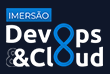

<a href="https://imersao.devopspro.com.br">
   
</a>

# Imersão DevOps && Cloud

Projeto prático do bootcamp para adicionar Docker, Kubernetes, CI/CD e monitoramento a um projeto.


**Passos para subir a aplicação:**
- Primeiro criar o cluster Kubernetes com o K3D fazendo o port bind das 2 portas para a aplicação
``` bash
k3d cluster create meucluster -p "3000:30000@loadbalancer" -p "8080:30001@loadbalancer"
```
- Construir a imagem docker da aplicação chatservice
- Aplicar o manifesto do chatservice
- Aplicar o manifesto do Keycloak 
- Alterar o arquivo host da máquina para adicionar o host keycloak 
- Construir a imagem docker da aplicação webapp
- Aplicar o manifesto da aplicação webapp

## Na AWS
Template de rede para o EKS do CloudFormations:

https://s3.us-west-2.amazonaws.com/amazon-eks/cloudformation/2020-10-29/amazon-eks-vpc-private-subnets.yaml

## Grafana
Comando para obter a senha do Grafana:
```
kubectl get secret --namespace default grafana -o jsonpath="{.data.admin-password}" | base64 --decode ; echo
```
